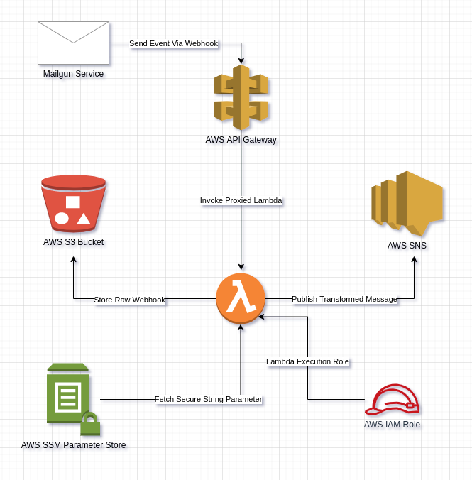

# Mailgun - Lambda - SNS

AWS Lambda Function that is proxied to an AWS API Gateway sends notification using AWS SNS which trigged on events and stores the results in AWS S3.

## Getting Started

This project is about building an AWS Lambda Function that triggered when an email goes out via [Mailgun](mailgun.com). Once its out, Mailgun sends various events back (open, clicked, etc). The moment wehn an an email sent out via Mailgun, we can track the email through those events via webhooks. The webhook put a POST request to an API Gateway and that information is proxied to a Lambda. The Lambda will first of all save a copy of the raw webhook and store it in any storage avilable i.e AWS S3 and publish a transformed version of the raw webhook into AWS SNS or using any publishing service.

## Design Choices and Implementation

For the provisioning of the infrastrcuture, Terraform is being used for IaC (Infrastructure as Code) to setup different AWS Services inlucding:

* AWS Lambda Function
* AWS API Gatewat
* AWS SSM
* AWS SNS
* AWS S3

Lambda function payload (**lambda_function_payload.zip**) contains the package for the deployment including:

- aws_s3.py (Contains AWS S3 Storage Service)
- aws_sns.py (Contains AWS SNS Publishing Service)
- aws_ssm.py (Contains AWS SSM Secret Management Service)
- lambda_handler.py (Contains the Lambda Function Handler)

The lambda function first parse the information coming from the mailgun event and extract the requried values and then it validates the webhook from mailgun. Store the event (raw webhook) data into the AWS S3 data store, also notify the endpoint user about different events from mailgun webhooks through AWS SNS publishing service.

***Note: Make sure to create a lambda_function_payload.zip again in case if you change anything in the source code of lambda***

## Architecture Flow Diagram



## Terraform Setup

***Terraform should be installed on the machine, you want to setup the project alongwith the aws cli installed and default profile is set with appropriate Access and Secret Keys***

To run this project:

- Initialize the terraform with plugin and provider:

  ```
    terraform init
  ```

- To confirm what resources are going to be added in the infrastructure:

  ```
    terraform plan
  ```

- To validate the infrastructure code for any error:

  ```
    terraform validate
  ```

- To apply the infrastructure changes:

  ```
    terraform apply
  ```

- To destroy the infrastructure changes:

  ```
    terraform destroy
  ```

## Linting

Lint the lambda function python source-code for bugs and quality checker using pylint as:

```
pip install pylint (if not installed already)
```
```
pylint -rn lambda_function_payload/*.py || true
```

## Testing:

Follow the below steps to test the solution:

- Make sure Mailgun Dashboard is setup and **HTTP webhook signing key** should be generated

- Copy the HTTP webhook signing key and paste it in the **secrets.tf** file

- Place your email address in the variable named **sns_topic_subscription_endpoint** in **terraform.tfvars**

- Deploy the Infrastructure through Terraform as defined above in [Steps](#terraform-setup)

- After the Infrastructure is deployed successfully, make sure to accept the confirmation email from AWS SNS Service

- Terraform will show you the **API_Invoke_URL** for the POST method, copy the URL and add the different webhooks in the **Mailgun Dashboard** using the API URL

- Afterwards, there is python script **mailgun.py** in **mailgun_test** folder, which can be used to send email using mailgun service

  - Type the following commands to install the **dependencies** and **execute** it:

    ```
    pip install -r ./requirements.txt
    
    python ./mailgun.py
    ```
  ***Note: Configure the code properly with the appropriate values i.e YOUR_DOMAIN_NAME and YOUR_API_KEY***